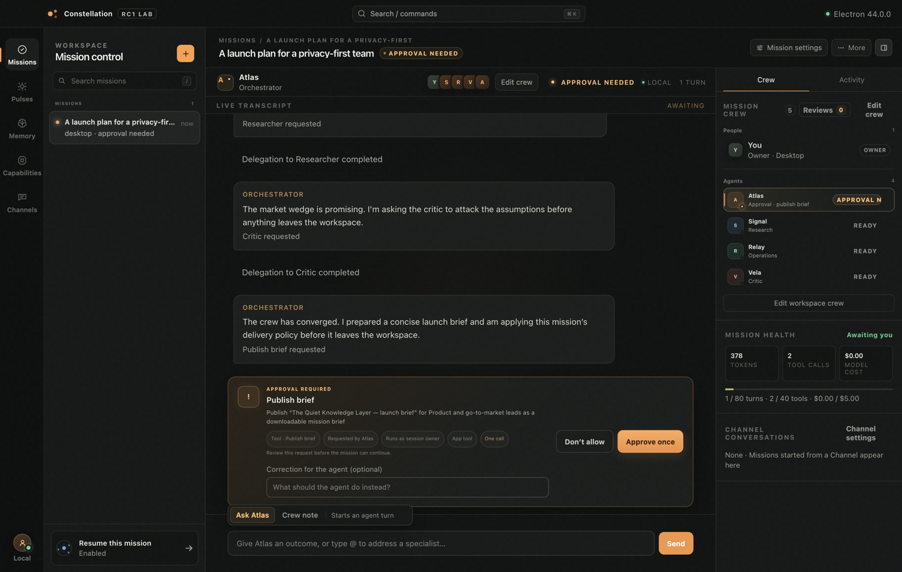

# meteor-agent

**A Meteor-native agent harness with
[pi-ai](https://github.com/earendil-works/pi) as its default model adapter.** Durable conversations,
streaming, tools, authorization, and recovery are built from the primitives
your Meteor app already uses—without a second realtime stack.

[v0.2.0](https://github.com/10thfloor/meteor-agent/tree/v0.2.0) ·
[CI](https://github.com/10thfloor/meteor-agent/actions/workflows/ci.yml) ·
Meteor 3.5+ · [MIT](LICENSE)

[Constellation](#constellation) ·
[Quick start](#quick-start) · [Why Meteor?](#why-this-exists) ·
[Tools](#tools--five-kinds) · [Durability](#durability) ·
[Learning](#agent-identity-and-experience) · [Channels](#channels) ·
[API reference](app/packages/agent/README.md)

## Constellation



**An agent operations room that runs on your laptop, no API key required.**
Constellation is the Electron showcase for the `v0.2.1-rc.1` runtime, and
everything in that window is the framework doing its job. The mission is a
durable session in Mongo. Atlas, the orchestrator, delegates to a specialist
crew through child sessions you can open and read. The amber bar is a parked
approval — the mission survives a restart while it waits for you. The meters
are enforced budgets, not decoration. And the Pulse screen schedules system
turns: agent work that starts with nobody at the keyboard.

```bash
npm install
npm run desktop:offline
```

Offline mode is deterministic end to end — subagents, approvals, attachments,
memory, forks, and system turns all run against the scripted provider. Plain
`npm run desktop` picks up a live provider when one is configured: an
Anthropic key, or a local Ollama. The [desktop guide](desktop/README.md)
covers the architecture, the security posture, and the other screens —
Missions, Pulse, Memory, Skills, and Channels.

Every piece of it maps to a Meteor primitive:

| Agent concern | Meteor primitive |
| --- | --- |
| Durable transcript | Mongo collection |
| Token streaming | Capped collection + publication |
| Tools | Meteor methods or server functions |
| Identity and authorization | `this.userId` + publications |
| Crash recovery | Leases + observers on every app server |

If you know Meteor, most of the system is already familiar. `meteor-agent`
supplies the durable model loop and keeps the rest native.

```ts
// server
import { Agent } from 'meteor/10thfloor:agent';

new Agent('support', {
  model: 'anthropic/claude-sonnet-5',
  instructions: ({ userId }) => `You help user ${userId} with their orders.`,
  tools: ['orders.lookup', 'orders.refund'],   // your existing Meteor methods
  budget: { turns: 20, spend: '$1.00' },
});
```

```html
<!-- client -->
<agent-chat agent="support"></agent-chat>
```

Or skip the element and build your own UI on a plain reactive cursor:

```ts
import { ClientAgent as Agent } from 'meteor/10thfloor:agent';

const Support = new Agent('support');
const sessionId = await Support.start();
Support.subscribe(sessionId);
await Support.send(sessionId, 'where is my order?');

Support.messages(sessionId).fetch();  // minimongo cursor — streaming tokens
Support.status(sessionId);            // 'idle' | 'streaming' | 'awaiting' | …
```

That cursor updates token by token, works in Blaze, React, Svelte, or plain
JavaScript, and needs no client-side AI library.

## Quick start

### Run the demo

```bash
git clone --branch v0.2.0 --depth 1 https://github.com/10thfloor/meteor-agent
cd meteor-agent/app
meteor npm ci
meteor run --port 3400
```

No API key is needed: the demo provider streams scripted responses through
the real transcript, tool, and approval paths. Try `what time is it?` or
`refund my order`. Set `PROVIDER_API_KEY` to an Anthropic key (or set
`ANTHROPIC_API_KEY`) and restart to use its real model.

### Install in an app

The packages are not yet on Atmosphere. From your Meteor app's root, vendor the
tagged core package at `packages/agent`, then install it normally:

```bash
git clone --branch v0.2.0 --depth 1 \
  https://github.com/10thfloor/meteor-agent ../meteor-agent-v0.2.0
mkdir -p packages
cp -R ../meteor-agent-v0.2.0/app/packages/agent packages/agent

meteor add 10thfloor:agent
meteor npm install --save @earendil-works/pi-ai typebox
meteor remove insecure autopublish
export PROVIDER_API_KEY=...          # one API-key provider; see Providers below
```

Need Slack, Telegram, WhatsApp, SMS, or email too? Vendor the matching
`app/packages/agent-channel-*` directory beside the core package. The
[package README](app/packages/agent/README.md#install) covers submodules,
`METEOR_PACKAGE_DIRS`, dependencies, and production requirements.

Define the server agent shown above, call `defineAgentChat()` on the client,
and place `<agent-chat agent="support"></agent-chat>` on a page.

### Test without spending a cent

```ts
import { mockProvider } from 'meteor/10thfloor:agent';
Support.define({ model: 'mock', instructions: '…',
  provider: mockProvider(() => ({ text: 'hi' })) });
```

The default package suite runs entirely network-free.

### Deploy to Meteor Galaxy

The first documented host target is Meteor Galaxy. `10thfloor:agent` deploys
inside **your own Meteor application**—it is not a separate agent service.
Follow the **[Galaxy deployment runbook](docs/deployment/galaxy.md)** to build
that host app, prepare secret-safe settings, and validate MongoDB reactivity
and model-spend controls. This repository's `app/` is documented separately in
the runbook as an optional platform smoke test, not a production starter.

## Why this exists

Every agent framework rebuilds the same four things: a durable transcript, a
live view of it, a permissioned set of operations the model may call, and a
loop that survives restarts. Meteor already ships the first three as
collections, publications, and methods. This package supplies the loop —
and inherits the rest from the framework instead of reinventing it.

The consequences are the interesting part:

- **Your methods are your tools.** A tool listed as `'orders.refund'` runs
  your existing method through a real `MethodInvocation` — `this.userId`,
  `this.unblock()`, and its own `check()` calls all work untouched. One
  implementation serves your UI and your agent.
- **Crashes are boring.** Assistant messages commit only at turn boundaries.
  A watcher on every app server finds durable unfinished work and nudges the
  private Activation Module; the Turn's exact per-session Lease claim chooses
  one runner. Kill a pod mid-stream and the Turn repairs itself and reruns.
- **Humans stay in the loop without holding a process open.** A tool marked
  `gate: 'ask'` *parks* the run — no timer, no waiting promise — and survives
  deploys until someone approves, denies, or a timeout does.
- **Cost has brakes.** Turn, tool-call, and dollar budgets are enforced
  before the spend they govern; provider-reported cost is preferred over
  price-table math; configurable DDP rate limits can guard every entry point.

## Streaming

Tokens arrive through a Mongo publication, not a side channel. The client
merges committed messages and in-flight deltas into one reactive cursor that
updates token by token.

```ts
// client
const Support = new Agent('support');
const sessionId = await Support.start();
Support.subscribe(sessionId);
await Support.send(sessionId, 'where is my order?');

Support.messages(sessionId).fetch();  // reactive cursor — streaming tokens included
Support.status(sessionId);            // 'idle' | 'streaming' | 'calling' | 'awaiting'
await Support.interrupt(sessionId);   // aborts the HTTP request, not just the UI
```

## Tools — five kinds

### Your existing Meteor methods

```ts
// server
tools: ['orders.lookup']
```

The method runs under a real `MethodInvocation` — `this.userId`, `this.unblock()`,
and its own `check()` calls all work untouched.

### Inline functions

```ts
// server
tools: [{
  name: 'clock',
  description: 'The current server time',
  args: { type: 'object', properties: {} },
  run: async () => new Date().toISOString(),
}]
```

### Co-registered method + tool

One definition, one schema, two callers — the model and your UI.

```ts
// server
const lookup = Agent.method('orders.lookup', {
  description: 'Look up an order by id',
  args: { type: 'object', properties: { id: { type: 'string' } }, required: ['id'] },
  run(args) { return Orders.findOneAsync({ _id: args.id, userId: this.userId }); },
});

Support.define({ model, instructions, tools: [lookup] });
await Meteor.callAsync('orders.lookup', { id });   // your UI calls the same thing
```

### MCP servers

```ts
// server
Agent.mcpServer('docs', {
  command: 'npx', args: ['-y', '@modelcontextprotocol/server-everything'],
});

Support.define({ model, instructions,
  tools: [{ mcp: { server: 'docs', tool: 'search' } }],
});
```

### Other agents

```ts
// server
tools: [{ subagent: 'researcher', description: 'Look something up' }]
```

### `runAs` — a tool with a fixed identity

A tool normally runs as the session's owner. `runAs` replaces that for one
tool, while authorization stays with the real user.

```ts
// server
tools: [{
  method: 'billing.credit', description: 'Issue a credit',
  args: { type: 'object', properties: { amount: { type: 'number' } }, required: ['amount'] },
  runAs: 'service-account',
}]
```

The real caller arrives as `ctx.callerUserId` — so the tool can act with
elevated privileges while still knowing who asked.

## Budgets

Turn, tool-call, and dollar limits are enforced before the spend they govern.
A send past the turn limit is refused; a tool call past the cap is never
dispatched.

```ts
// server
Support.define({
  model, instructions, tools,
  budget: {
    turns: 20,            // sends refused at 21
    toolCalls: 40,        // per session
    spend: '$1.00',       // provider-reported cost preferred over price-table math
    approval: 3600000,    // ms a gate:'ask' may sit unanswered
  },
});
```

An agent whose budget sets none of `turns`, `toolCalls`, or `spend` is named
in a startup warning — nothing bounds its spend.

## Approval gates

Any tool can require human approval before it runs. The turn parks — no timer,
no waiting promise — and survives deploys until someone answers.

```ts
// server
tools: [{
  name: 'refund', description: 'Refund an order',
  args: { type: 'object', properties: { orderId: { type: 'string' } }, required: ['orderId'] },
  gate: 'ask',
  run: async (args) => Refunds.issueAsync(args.orderId),
}]
```

Or decide per call:

```ts
// server
gate: ({ args }) => args.amount < 50 ? true : 'ask'
```

```ts
// client
await Support.approve(sessionId);
await Support.deny(sessionId, 'the amount is too large');
```

Two people clicking Approve at the same time? One wins — atomic conditional
write. A timeout nobody answers? The watcher denies it automatically.

## Subagents

Put one agent behind another's tool call. The child gets its own session,
transcript, live stream, and budgets.

```ts
// server
new Agent('researcher', {
  model: 'anthropic/claude-sonnet-5',
  instructions: 'You look things up and answer in one paragraph.',
  budget: { toolCalls: 8, spend: '$0.25' },
  startable: false,
});

new Agent('writer', {
  model: 'anthropic/claude-sonnet-5',
  instructions: 'You draft answers, delegating research when you need a fact.',
  tools: [{ subagent: 'researcher', description: 'Ask the researcher' }],
});
```

```ts
// client — subscribe to the child's live stream while it runs
const active = Writer.session(sessionId)?.activeChild;
if (active) new Agent('researcher').subscribe(active.sessionId);
```

Nesting is depth-guarded (3 levels). Fan-out is bounded by `budget.toolCalls`.

## Forking

Branch any conversation and diverge. The original is untouched.

```ts
// client
const branch = await Support.fork(sessionId);
const earlier = await Support.fork(sessionId, { atSeq: 12, title: 'What if' });
Support.subscribe(branch);
await Support.send(branch, 'try it the other way');
```

`atSeq` is clamped to the nearest safe cut — you can pass whatever seq the user
clicked without knowing anything about tool batches.

## Compaction

Long conversations summarize themselves. The model's context window shrinks,
but the full transcript is preserved for humans and audits.

```ts
// server
Support.define({
  model, instructions, tools,
  context: { window: 200000, compactAt: 0.8, keep: 6 },
});
```

When the transcript exceeds 80% of the window, everything before the last 6
messages is summarized into a single row. Swap the summarizer with a hook if
you want a cheaper model or a different prompt.

## Skills

On-demand prompt fragments the model can load when it needs them, rather than
stuffing everything into the system prompt.

```ts
// server
Support.define({
  model, instructions,
  skills: [
    { name: 'refunds', description: 'The refund policy and steps', content: '…' },
    { name: 'escalation', description: 'When and how to escalate', content: '…' },
  ],
});
```

The model sees a `## Skills` listing and a `skill` tool. It calls the tool to
load the content it needs for the current question.

## Fact Memory

Agents that remember — the person, and the work. It is a Mongo collection, so
your UI can show the user exactly what is stored and let them delete it.

```ts
// server
Support.define({ model, instructions, memory: true });
```

Three tools appear (`memory_save`, `memory_search`, `memory_forget`) and a
compact listing of what is remembered rides the system prompt — titles only, so
ten memories cost ten lines and the details arrive through a tool call the
transcript records. With the default `memory: true` configuration, Fact Memory
is keyed by **user**, so every model in a session shares one store: what
`support` learns, `analyst` recalls.

Facts about the *work* — true for every user — live in a shared pool that a
human approves before it lands, and approves again before it is deleted:

```ts
// server
Support.define({ model, instructions, memory: { scopes: ['user', 'app'] } });
```

```
model → memory_save { text: 'orders table soft-deletes', scope: 'app' }
       ↓ parks for approval, showing the human what would be shared
human → Approve  →  every session's agent now knows it, stamped by:'m:support'
```

Semantic recall comes from MongoDB itself — `$vectorSearch` with automated
embedding, so there is no embedding pipeline and no second database — and
degrades to text search and then regex rather than failing a turn. It works on
a stock dev database and gets better on a real one.

```ts
// client — the user's memory page is an ordinary subscription
Meteor.subscribe('agent.memories');
await Meteor.callAsync('agent.memoryForget', { id });
```

The client surface is deliberately narrower than the model's: approval gates
run only inside the turn loop, so writing shared knowledge from a browser is
refused outright. See the
[Fact Memory design](docs/superpowers/specs/2026-08-23-agent-memory-design.md).

## Agent identity and Experience

The split is intentional: **Fact Memory is what the Agent knows. Practice is
how the Agent gets good at the job. Constitution is how the Agent chooses to
be.** Experience is the expectation-versus-observation evidence from which a
Practice may be reviewed, and a Memory Frame is the exact causal receipt for
one Turn. These are separate records because facts, competence, and character
must not silently rewrite one another.

```ts
Support.define({
  model,
  instructions,
  identity: {
    id: 'support-agent-v1',       // keep stable across renames and model changes
    displayName: 'Support',
    constitution: 'Protect customer trust. State uncertainty.',
    flexibility: 4,
  },
  experience: { record: true, recall: { recent: 8 }, approval: 'ask' },
  practice: { acquire: true, approval: 'ask' },
});
```

The conservative defaults remain attended: `experience_propose` asks before it
records, and `practice_propose` leaves an inert candidate in Reviews.
`experience.approval: 'auto'` records immediately for post-admission audit;
`practice.approval: 'auto'` may validate an evidence-bound candidate as a
reversible trial, but can never harden it. The two policies are independent.
`experience_search` returns bounded active evidence. Each Experience records
whether its expectation was `explicit`, `inferred`, or `retrospective`, so
hindsight is visible instead of smuggled in as prediction.

Validated and hardened Practices plus the active Constitution are frozen into
a per-Agent, per-Session-trigger Memory Frame before provider work. Retries and
approval resume adopt the same Frame; learning changes apply on the next Turn.
The same identity layer applies to `Agent.ask()`: its Constitution and
Practices shape the one-shot, while its Session-owned Frame and transcript are
erased in `finally`. When Experience recall is enabled, its frozen evidence
remains searchable. An ask-gated Experience proposal parks for an approval a
headless caller cannot provide; automatic policy can admit it before cleanup,
while `canUse` may still deny either route.

Session erasure deletes its Frames but retains Agent-owned Constitution,
Experience, and Practice. Archiving an Agent preserves that identity history
while blocking new work.

### The app's interface

All of this ships in the package — Constellation is a consumer of it, not the
home of it. The interface is the Meteor one: configuration on the Agent, a
publication you write, methods you write, and client collections.

```ts
// server — you decide WHO may see WHICH agents; the package owns the reviewed
// field allowlists, observer lifecycle, idempotency, and the refusal codes.
import {
  Agent, createLearningPublisher, governedLearningReview, assertLearningReviewTarget,
} from 'meteor/10thfloor:agent';

Meteor.publish('team.learning', async function () {
  if (!this.userId) return this.ready();
  const publisher = createLearningPublisher(this);
  for (const agentId of await agentIdsOwnedBy(this.userId)) await publisher.addAgent(agentId);
  this.ready();
});

Meteor.methods({
  async 'team.learningReview'(agentId, target, targetId) {
    check(agentId, String); check(target, String); check(targetId, String);
    assertLearningReviewTarget(target);
    await assertOwnsAgent(this.userId, agentId);       // your authorization, your rules
    return governedLearningReview('team', agentId, target, targetId, this.userId);
  },
});

// Privileged server access, when the host itself is the actor:
await Agent.memory.save(userId, { text: 'prefers email', scope: 'user' });
await Agent.learning.review({ agentId, target: 'experience', id, source });
```

```ts
// client — reviewed rows are ordinary client collections
const AgentExperiences = new Mongo.Collection('agent_experiences');
const AgentPractices = new Mongo.Collection('agent_practices');
Meteor.subscribe('team.learning');
Meteor.subscribe('agent.memories');                           // Fact Memory, built in
AgentExperiences.find({ agentId, admission: 'automatic', review: { $exists: false } });
await Meteor.callAsync('team.learningReview', agentId, 'experience', experienceId);
await Meteor.callAsync('agent.memoryForget', { id });         // Fact Memory, built in
```

Fact Memory arrives with its publication and methods already registered
(`agent.memories`, `agent.memorySave`, `agent.memorySearch`,
`agent.memoryForget`). Learning deliberately registers neither: which people
may see which Agents is the application's decision, so the package hands you
the two halves that are not — the publisher and the governed mutations — and
the [package README](app/packages/agent/README.md#host-publication-and-mutations)
lists all five. Constellation's `app/server/main.js` is the reference wiring.
See the [primer](docs/agent-experience-primer.md),
[ADR 0001](docs/adr/0001-agent-experience-memory.md), and
[ADR 0002](docs/adr/0002-automatic-learning-governance.md).

## Hooks

Two extension seams: what goes out to the provider, and what comes back from a
tool.

```ts
// server
Agent.hook('beforeProviderRequest', (req, ctx) => {
  return { ...req, system: `${req.system}\n\nToday is ${new Date().toDateString()}.` };
});

Agent.hook('afterToolResult', (result, call, ctx) => {
  if (call.name !== 'orders.lookup' || !result.ok) return;
  const order = result.value;
  return { ...result, value: { ...order, card: `••••${order.card.slice(-4)}` } };
});
```

Per-agent hooks scope to one agent:

```ts
// server
Support.hook('beforeProviderRequest', (req, ctx) => {
  if (ctx.purpose === 'compaction') return { ...req, model: 'anthropic/claude-haiku-4-5' };
});
```

Global hooks run first; per-agent hooks run after. A broken hook is skipped
with a warning — it never kills a turn.

## Durability

Kill the server mid-stream. The assistant message was never committed — only
deltas were, and they are scratch. The Lease expires, the watcher finds the
durable orphan and nudges Activation. A Turn then wins the exact Lease claim and
re-runs from the last committed row. One assistant row lands, never two, never a
half.

```
provider streaming ──▶ kill -9 ──▶ Lease expires (≤30s) ──▶ watcher observes
  ──▶ Activation nudges ──▶ exact Lease claim ──▶ Turn repairs, commits, idles
```

No application code or Activation API is required. The watcher starts at boot
on every server; existing `Agent` calls remain the public entry points.

## Validation

Model-supplied tool arguments are checked against the JSON Schema you already
wrote in `args`. Invalid arguments are refused as a tool result the model reads
and retries — no exception, no crash.

```ts
// server
tools: [{
  name: 'transfer',
  description: 'Transfer funds',
  args: {
    type: 'object',
    properties: {
      to: { type: 'string' },
      amount: { type: 'number', minimum: 0 },
    },
    required: ['to', 'amount'],
  },
  gate: 'ask',
  run: async (args, ctx) => Transfers.executeAsync(args, ctx.userId),
}]
```

Schemas are compiled once per process (typebox). If the compiler is unavailable,
the interpreted checker takes over. If no full checker is available, schemas
made only of structural keywords are checked structurally; richer schemas are
refused rather than run with partially checked arguments.

## Providers

The default adapter uses [pi-ai](https://github.com/earendil-works/pi) for its
model catalog, request conversion, streaming, authentication, and provider
APIs. The Meteor-native durable loop, transcript, tools, authorization, and
recovery remain this package's job.

For a deployment using one API-key provider, set a generic key and select that
provider in the model string:

```bash
export PROVIDER_API_KEY=...
```

```ts
// server — PROVIDER_API_KEY must be valid for the "anthropic" provider
Support.define({ model: 'anthropic/claude-sonnet-5', instructions: '…' });
```

`PROVIDER_API_KEY` is passed to pi-ai as an explicit key, so it takes precedence
over provider-specific authentication. It is intended for a deployment where
all default-adapter agents share one provider credential (including a compatible
gateway). For agents using several providers at once, leave it unset and use
pi-ai's provider-specific environment variables instead:

```bash
unset PROVIDER_API_KEY
export ANTHROPIC_API_KEY=...
export OPENAI_API_KEY=...
export OPENROUTER_API_KEY=...
```

```ts
new Agent('support', { model: 'anthropic/claude-sonnet-5', instructions: '…' });
new Agent('writer', { model: 'openai/gpt-5', instructions: '…' });
```

Ambient and interactive credentials—such as AWS credentials for Bedrock,
Google ADC, or OAuth—continue to use pi-ai's native resolution; the generic
API-key override does not replace those flows.

Swap to a mock for tests and demos — no key, no network, full suite:

```ts
// server
import { mockProvider } from 'meteor/10thfloor:agent';

Support.define({
  model: 'mock', instructions: '…',
  provider: mockProvider(() => ({ text: 'hi there' })),
});
```

Or write your own — any object with a `stream()` method:

```ts
// server
const echo = {
  async *stream(req) {
    const last = [...req.messages].reverse().find(m => m.role === 'user');
    for (const ch of `you said: ${last?.content ?? ''}`) yield { kind: 'text', chunk: ch };
    yield { kind: 'done', usage: { input: 7, output: 3 } };
  },
};
```

## Headless: no UI at all

`ask()` is the whole conversation in one call — throwaway session, one turn,
cleanup in `finally`.

```ts
// server
Meteor.methods({
  async 'support.summarize'(orderId) {
    check(orderId, String);
    return Support.ask(`Summarize order ${orderId}.`, { userId: this.userId });
  },
});
```

## `<agent-chat>`

A custom element that never registers itself — call `defineAgentChat()` to
opt in. Shadow DOM, themable through CSS custom properties and `::part()`.

```ts
// client
import { defineAgentChat } from 'meteor/10thfloor:agent';
defineAgentChat();
```

```html
<agent-chat agent="support" placeholder="Ask about your order…">
  <h1 slot="header">Support</h1>
</agent-chat>
```

```css
agent-chat {
  --agent-chat-accent: #6d28d9;
  --agent-chat-font: 'Iowan Old Style', Georgia, serif;
}
agent-chat::part(message user) { border-radius: 0.25rem; }
agent-chat::part(phase awaiting) { text-transform: uppercase; }
```

Session persistence, error recovery, and the approval prompt are built in.
Clean assistant replies render safe, semantic Markdown; raw HTML, remote images,
user messages, and debug traces stay literal.
Drop to `Agent` directly for layouts it does not have or two sessions side by
side.

## Channels

The same agent can meet users in Slack, Telegram, WhatsApp, SMS, email, and the
web app at once. A channel is two adapters over the machinery above—a verified
webhook in and a delivery worker out—plus a **lens**: one object that renders
outbound items into the surface's native form and interprets inbound events
back into a fixed set of meanings.

```ts
// server
import { sms } from 'meteor/10thfloor:agent-channel-sms';

const cfg = Meteor.settings.packages['10thfloor:agent'].sms;
Agent.channel('sms', sms({
  agent: 'support',
  accountSid: cfg.accountSid,   // AC…
  authToken: cfg.authToken,     // also the signature key
  webhookUrl: cfg.webhookUrl,   // the EXACT public URL Twilio calls
}));
```

The factory is sugar over a plain channel definition — the same pieces you
would write for a surface of your own:

```ts
Agent.channel('sms', {
  agent: 'support',
  transport: smsTransport({ accountSid, authToken }),
  lens: smsLens,                              // { out, in } — two halves, one object
  profile: { interact: 'menu', limit: 1500 }, // choices render as "Reply YES / NO"
  verify: (raw) => verifyTwilioSignature(raw, authToken, webhookUrl),
  parse: (raw) => parseTwilioForm(raw.rawBody),
  statuses: ['error', 'approval'],
});
```

(where `accountSid`, `authToken`, `webhookUrl` are the same three settings
values). The webhook mounts at `/agent/channels/sms`; the worker delivers every
committed reply to every surface bound to the session. One conversation can be
live in Slack, mirrored over SMS, and open in the web app at once — each
surface tracks its own cursor, so a downed gateway delays only itself.

Five surfaces ship today, each a package of exactly one lens, one transport,
and one profile — **Slack** (threads, buttons, mrkdwn), **Telegram** (inline
keyboards, secret-token webhooks), **WhatsApp** (reply buttons, the signed
Cloud API, the 24-hour window handled honestly), and **SMS via Twilio** (the
reply-menu grammar: "Reply YES to approve"), and **Email via Postmark**
(threaded replies and single-use approval links). The same parked approval is
rendered in the native interaction style of each surface; first answer wins.

What you inherit without writing it: **deduplicated admission** (provider
retries with the same event id are ignored during the seven-day retention
window), **receipt-backed delivery** (confirmed sends
survive redeploys; each channel declares whether an uncertain send is retried,
reconciled, or abandoned), **approvals over any surface**
(buttons where the surface has them, "Reply YES to approve" where it doesn't,
single-use links where replies are awkward — same single-winner verdict
either way), and **account linking with assurance levels**, so a gate can say
"auto-approve for OAuth-proven users, ask otherwise" in a few lines:

```ts
gate: async ({ sessionId }) => {
  const session = await AgentSessions.findOneAsync(sessionId);
  return session?.channel?.assurance === 'oidc' ? true : 'ask';
}
```

A new surface is a few dozen lines — two functions and one shipped property
test (`assertLensRoundTrip`) that proves every affordance you render reads
back as the meaning you meant. The design is
[`2026-08-20-channels-multi-surface-delivery.md`](docs/superpowers/specs/2026-08-20-channels-multi-surface-delivery.md).

## Further reading

The **[package README](app/packages/agent/README.md)** is the full API
reference — config surface, tools, budgets, gates, subagents, MCP, skills,
hooks, theming, channels, and the operational notes that matter in production.
**[by-example.md](docs/by-example.md)** covers the same ground as working
code — including a failure drill that kills the server mid-stream and watches
the transcript put itself back together. Historical architectural decisions
live in **[docs/superpowers/specs/](docs/superpowers/specs/)**; source and tests
are authoritative where an older record describes an earlier release.

## Requirements

- **Meteor 3.5+** (change streams, async DDP rate limiters, Node 24)
- **Transaction-capable MongoDB** — a replica set or sharded cluster. Transcript
  commits pair dependent writes with the Session erasure fence in a transaction;
  Atlas or a single-node `--replSet` is sufficient.
- `typebox` for full tool-argument validation.
- `@earendil-works/pi-ai` as an app dependency unless you bring your own
  provider; `@modelcontextprotocol/sdk` only if you use MCP tools.

## How it holds together

```
send() ─▶ authorize ─▶ reserve ─▶ [atomic seq + budget + message + wake]
                                                                    │
                 Activation ─▶ exact lease claim ─▶ turn loop       │
                                                        │           │
   provider stream ──chunks──▶ [bounded capped deltas] ─┴───────▶ merged cursor
                     └──done──▶ [atomic Session + message commit]
```

The reservation and Activation machinery are private. `Agent.send(sessionId,
text)` is unchanged: it resolves after the user Message is durable, while a
compact Session marker remains until the Transcript proves that input was
answered. A crash at any commit step is reconciled to the same Message and
sequence without charging the Turn budget twice; the exact Lease claim still
chooses the single Turn runner.

The design reasoning — the lease model, repair invariants, approval-gate
semantics, and why the merge walks backward — is preserved in the historical
design records under [`docs/superpowers/specs/`](docs/superpowers/specs/).

## Project layout

```
app/packages/agent/                   the package (this is what ships)
app/packages/agent-channel-slack/     Slack surface     ┐
app/packages/agent-channel-telegram/  Telegram surface  │ one lens, one
app/packages/agent-channel-whatsapp/  WhatsApp surface  │ transport each
app/packages/agent-channel-sms/       SMS (Twilio)      │
app/packages/agent-channel-email/     Email (Postmark)  ┘
app/                                  reference/test host; not an app template
docs/deployment/                      production-host deployment runbooks
docs/superpowers/specs/               historical architectural decisions
scripts/verify-build.sh               proves the loader against a real production bundle
release.json                          the verified core + channel package set
deploy/galaxy.settings.example.json   host-app Galaxy settings starting point
```

Development workflow, the test command, and the npm-dependency policy are in
**[CONTRIBUTING.md](CONTRIBUTING.md)**.

## Status

The current public source release is
[`v0.2.0`](https://github.com/10thfloor/meteor-agent/tree/v0.2.0). Until the
Atmosphere packages are published, vendor the package directories from this
repository as described above. CI type-checks source and published
declarations, runs the core and all five channel suites, audits production
dependencies, and verifies a production Meteor bundle.

The default suite uses mock providers. Separate opt-in live smokes cover a real
provider and MCP process. Channel providers differ in their guarantees around a
crash between sending and recording a receipt; each channel README names that
tradeoff explicitly.

## License

[MIT](LICENSE)
