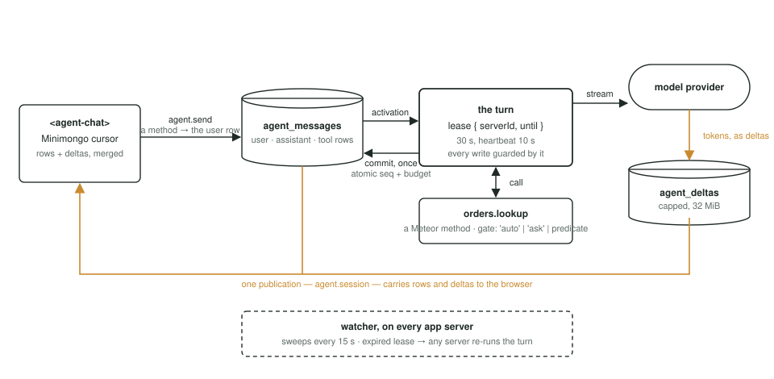
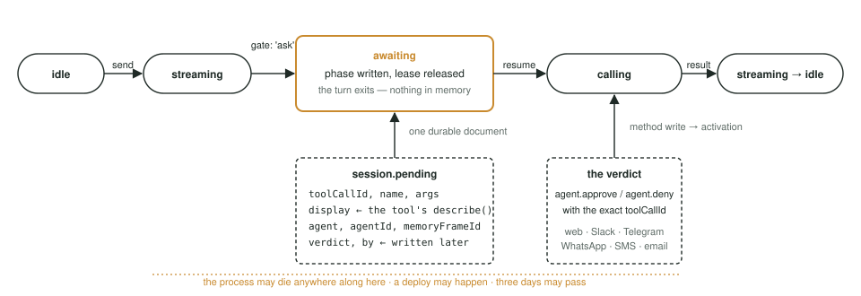
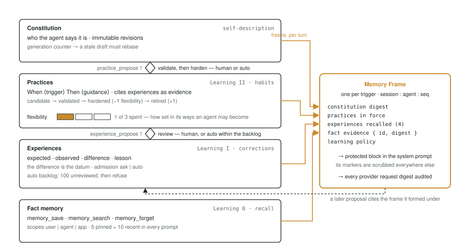

# The Other Half of an Agent

*Meteor already solved durability. What was left was memory — and memory turned out to be an ecology.*

An agent framework is mostly a durability problem. That is an unpopular thing to say about a field that presents itself as a prompting problem, but watch what actually fails in production: a process dies forty seconds into a stream. A human takes three days to approve a refund. Two app servers pick up the same conversation. A user closes the tab mid-answer and opens it on a phone. None of that is about the model. All of it is about where state lives, who holds the lock, and what the transcript says afterward.

Every agent framework we looked at answered those questions by building a second realtime stack next to the application: a queue, a stream, a lock, a store, and a websocket to carry it all to the browser. We were already running Meteor. Meteor is a realtime stack. So we asked a narrower question than "how do we build an agent framework": how far do collections, publications, methods, and `this.userId` get you before you need anything else?

The answer is further than we expected — right up to the point where the agent has to remember. Durability, streaming, approvals, recovery, channels, scheduled work: Meteor primitives all the way down. Memory is where the primitives stop helping, and where a sixty-year-old book about the ecology of mind started helping instead. This post is about both halves.

## Part I — What's hard about agents?

Three things, in increasing order of how long they took us.

**A turn is long.** A single agent turn spans several model calls and tool executions; with a person in the loop it can span days. It has to survive a deploy, a crash, a server rotation, and a browser refresh, and it has to be resumable by *any* app server, not the one that started it.

**A turn has side effects that need permission.** A refund, an outbound email, a file written to someone's drive. The framework needs a way to stop mid-turn, ask a human, and continue later — durably, so the ask survives everything the turn survives, and safely, so the thing that runs after approval is exactly the thing the human saw.

**An agent that doesn't remember is an expensive function.** Store facts and you get recall. Recall is not the same as learning. An agent that learns changes *how* it responds, and that has to be governed: someone has to be able to see and approve who the agent is becoming.

The first two are durability problems. The third is an epistemology problem wearing a database. We'll take them in order.

## Part II — Everything is a collection

Here is the entire architectural bet in one table.

| Agent concern | Meteor primitive |
| --- | --- |
| Durable transcript | Mongo collection |
| Token streaming | Capped collection + publication |
| Tools | Meteor methods or server functions |
| Identity and authorization | `this.userId` + publications |
| Crash recovery | Leases + observers on every app server |

A session is a document in `agent_sessions` with a `phase` — one of `idle`, `streaming`, `calling`, `awaiting`, `compacting`, `retrying`, `stopped`, `error` — and a transcript in `agent_messages`, one row per user message, assistant message, tool result, or note. Tokens stream through `agent_deltas`, a 32 MiB capped collection. Both are published per session, and Minimongo merges the deltas into the message cursor on the client. That is the whole streaming story: the browser reads a reactive cursor that updates token by token, in Blaze, React, Svelte, or plain JavaScript, with no client-side AI library.

```ts
// client
import { ClientAgent as Agent } from 'meteor/10thfloor:agent';

const Support = new Agent('support');
const sessionId = await Support.start();
Support.subscribe(sessionId);
await Support.send(sessionId, 'where is my order?');

Support.messages(sessionId).fetch();  // minimongo cursor — streaming tokens
Support.status(sessionId);            // 'idle' | 'streaming' | 'awaiting' | …
```

The server side is an `Agent`, and its tools are your existing methods.

```ts
// server
import { Agent } from 'meteor/10thfloor:agent';

new Agent('support', {
  model: 'anthropic/claude-sonnet-5',
  instructions: ({ userId }) => `You help user ${userId} with their orders.`,
  tools: [
    'orders.lookup',                              // adopt a Meteor method by name
    { method: 'orders.refund', gate: 'ask',       // same, but a human approves each call
      description: 'Refund an order to its original card.',
      args: { type: 'object', properties: { orderId: { type: 'string' } } },
      describe: ({ orderId }) => `Refund order ${orderId} to the original card.` },
  ],
  budget: { turns: 20, toolCalls: 40, spend: '$1.00' },
});
```

A string adopts a method. An object adopts one with a gate — `'auto'`, `'ask'`, or a predicate — and an optional `describe`, which is the tool's own one-line account of what it is about to do, written for the human who will approve it. There are three more tool kinds (inline functions, subagents, and MCP servers), and they all take the same gate. Authorization is not a new concept: the method runs with the session owner's `userId`, publications filter by it, and a `canUse` predicate on the agent can veto a tool per user, per call.

**A turn is a lease, and every write is guarded by it.** When a server starts a turn it claims the session with `lease: { serverId, until }` — 30 seconds, heartbeat every 10 — and every session write for the rest of the turn is conditioned on holding that exact lease. If the lease is lost, the write fails and the turn abandons; it never clobbers a successor. Assistant messages commit only at boundaries: the tokens are deltas until the model call ends, and then one message row lands in one atomic write that also allocates its sequence number and charges the budget. A `stop` outranks everything. Session modifications use `$`-operators only, because a replacement document would strip the lease along with everything else. These are the loop's invariants, and the suite encodes each of them with a failure-injection test that would fail if the invariant were removed.

Recovery follows from the lease. Every app server runs a watcher that sweeps every 15 seconds for sessions with expired leases and unfinished work, and a change observer that reacts to the same conditions live. Whichever server notices first claims the lease and re-runs the turn from durable state. There is no special recovery code path; recovery is just activation, which is just the ordinary way any turn starts.



*Figure 1. One turn. The user row is a method write; the turn is a lease; tokens flow through the capped collection to a publication and into Minimongo; tool calls are method calls; the assistant row commits once, at the boundary.*

The tests are the same tests a Meteor app already knows how to run. `meteor test-packages` with `meteortesting:mocha`, six packages, 836 server and client tests. The client half runs in headless Chromium against the real DDP round trip — a streamed reply arriving in a merged cursor, a live transcript retracted the instant its human participant is removed.

## Part III — Parking

The approval problem has a beautiful answer once the transcript is a collection: **a turn that needs permission doesn't wait. It exits.**

When a gated tool asks, the turn writes one durable marker — `phase: 'awaiting'` and a `pending` document with the tool call's id, name, arguments, the `describe` text, and which agent asked — releases its lease, and returns. Nothing is held in memory. The process can die. The deploy can happen. The human can answer three days later from a phone. The verdict is a method write (`agent.approve` or `agent.deny`, with the exact tool call id so a stale answer can't approve a different ask), and activation treats it like any other durable cause: it starts a turn, the turn finds the marker, and the marker tells it what to resume.



*Figure 2. The park is a phase. `awaiting` survives restarts because it is a document, not a promise. The verdict is a write; the resume is an ordinary activation.*

This is where the `describe` text earns its keep. A parked turn renders the same way on the web client, in Slack, in Telegram, on WhatsApp, over SMS, and by email. Those five surfaces are five packages, each one a *lens* that renders outbound items and reads inbound intents, and they are held to one law, shipped as a property test called `assertLensRoundTrip`: **if a lens renders a button, it must interpret the click; if it renders "Reply YES," it must interpret YES.** The test synthesizes every affordance the lens emits, feeds it back through the lens's own reader, and asserts the canonical intent comes out. A second clause makes it fail if the tool's `describe` text never reaches the human — which is how we discovered that four of the five surfaces were showing approvers a JSON dump instead of "Refund order o1 to the original card." SMS is 1,500 characters; it can't carry both, and the JSON is the half a texter can't read.

## Part IV — Work that starts without a person

Every mechanism so far begins with a human sending a message. That leaves out a whole category of agent: the one that checks something every four hours, the one that reviews last week's decisions on Monday morning, the one that watches deliveries and escalates the failed ones.

A system turn is a turn no person asked for. `Agent#systemTurn(sessionId, prompt, { key, agent, source })` writes a `role: 'system'` row, attributed to a source rather than a user, and activates the session. It is idempotent by key — the second request with the same key is a no-op, which is what makes it safe to call from anything that might fire twice. If the session is busy, the intent parks behind the current work and materializes when it becomes the selected cause; approvals and human input never accidentally consume it. It draws on its own `budget.systemTurns`, so a runaway schedule cannot spend the human's turn budget.

**There is no scheduler in the framework, deliberately.** A scheduler is an application concern with application opinions: catch-up policy, timezones, coalescing, ownership. The framework's job is the primitive underneath — an idempotent, durable, machine-initiated turn — and it stops there. Constellation's Pulse screen is the application half: a `Meteor.setInterval` every 15 seconds scans due rows, claims each with a compare-and-swap on `nextRunAt`, and calls `systemTurn` with the key `pulse:<id>:<scheduledFor>`. Missed runs coalesce into one catch-up; old intervals are not replayed. The whole scheduler is a few hundred lines of ordinary Meteor server code, and it could be replaced with a cron package or a queue without the framework noticing.

## Part V — Memory as an ecology

Fact memory came first, and it is what everyone builds first: `memory_save`, `memory_search`, `memory_forget`, scoped to a user, an agent, or the whole app; the five pinned and ten most recent facts render into every prompt, and a hint search (vector, then text, then regex, whichever the deployment can do) pulls in the rest. It is genuinely useful. It is also, in Gregory Bateson's terms, Learning 0: the agent recalls, and nothing about the agent changes.

Bateson spent a career on the observation that learning has logical types. Learning I is correction within a fixed set of responses — you tried something, it went differently than expected, next time you'll try the other thing. Learning II is a change in the *set* — you become a different kind of responder, and the aggregate of that, he argued, is what we call character. The types must not be confused: a fact is not a lesson, and a lesson is not a habit. We took that seriously enough to give each type its own collection, its own admission rules, and its own review queue.

**An Experience is a difference, not an observation.** The record is `expected`, `observed`, `difference`, `lesson` — what the agent thought would happen, what did, the gap, and what it draws from the gap. The difference is the datum; the observation is context for it. Bateson's definition of information was "a difference which makes a difference," and this is that definition as a schema. The agent proposes one with the `experience_propose` tool, under one of two admission policies: `ask`, where a human approves the record, or `auto`, where it lands directly but a review backlog of at most 100 unreviewed records applies backpressure — past that, automatic learning refuses until someone looks.

**A Practice is a habit, and habits cost flexibility.** A Practice is `When <trigger> Then <guidance>`, proposed with the experiences that are its evidence, and it moves through a lifecycle: candidate, validated, hardened, retired. Hardening a Practice — making it standing behavior — consumes one unit of the identity's *flexibility*, which defaults to 3; retiring a hardened Practice refunds it. Bateson's late essays treat flexibility as uncommitted potential for change, spent every time a system commits to a fixed pattern, with rigidity as the pathology of spending it all. We didn't set out to transcribe that. The budget fell out of asking how many habits an agent should be allowed to lock in before a human has to retire one.

**A Constitution is who the agent says it is,** in immutable revisions guarded by a generation counter — a revision drafted against a stale generation is refused with `identity-generation-conflict` and has to be rebased, exactly like a merge. And an **Identity** is the durable thing all of this attaches to: it survives display-name changes, model swaps, and reconfiguration, and it has a lifecycle, so an archived agent's habits stop applying without being erased.

None of that would be trustworthy without knowing, for any given turn, what the agent actually knew. So every identity-enabled turn freezes a **Memory Frame**: the constitution's digest, the practices in force, the recalled experiences (four by default), and the exact fact-memory rows in the prompt, keyed by session, agent, and the sequence number of the message that triggered the turn. The frame renders into a protected block in the system prompt — delimited by a reserved marker that is scrubbed from every other model-bound string, so nothing arriving in a tool result can impersonate reviewed authority — and the digest of every provider request made under that frame is written to an append-only audit trail. Later, when the agent proposes an experience, the proposal cites the frame it was formed under. Provenance is not a log line; it is a foreign key.



*Figure 3. Four stores, four logical types. A turn freezes a Frame from the stack; proposals flow up through review; hardening spends flexibility.*

Everything above the fact-memory line is governed. Automatic admission goes to a review backlog; human-approved admission goes through the same park-and-approve mechanism as a refund; the app-side surface for all of it — five governed mutations, the publication field allowlists, structured error codes — ships in the package, so a host wires authorization and nothing else. The ecology part is what happens over time: experiences decay out of recall, practices get retired, review queues apply backpressure, and the agent's character is whatever survives selection. Nothing is stored forever just because it was once true.

## Part VI — When the invariant met the approval

We should tell you about the bug, because it is the most instructive thing that happened.

The frame rule says a frame belongs to exactly one trigger, and recovery fails closed if the frame's evidence changed while the turn was away — the causal snapshot must not be silently swapped under a parked approval. The park rule says a human's approval survives everything. They collided in the most ordinary sequence imaginable: the agent saves a fact, then asks permission for the next call. The save changes fact memory. The park resumes, re-renders memory, sees the change, fails closed, and destroys the approval — deterministically, every time, and only for the well-behaved agent that remembered something before asking. Five independent review passes found it from five directions.

The fix was a reading, not a rewrite. "Evidence changed" means the *frozen* evidence: recovery fetches the rows the frame actually froze, by id, and fails closed only if one of those was edited or erased. Rows added since — the turn's own save, another session's — are not this frame's causes and cannot void an approval. Parks now carry their frame's id, so a resume adopts the exact frame the call was proposed under instead of re-deriving it from whatever message is newest. And assistant rows stamp `answeredThrough`, the highest user message the model actually saw, so a message that lands mid-stream is recognized as unanswered even though the reply committed after it. The decision record names three tradeoffs we accepted on purpose. That is the shape we want every hard decision in this codebase to have: a mechanism, a test that fails without it, and a sentence saying what it cost.

## Part VII — Constellation

Constellation is the showcase: an Electron window over the example app, running on `127.0.0.1:3210`, with an orchestrator called Atlas and three specialists — Signal for research, Relay for operations, Vela as critic — each with its own identity, constitution, and flexibility budget. Missions are sessions. The approval bar is a park. Pulse is the scheduler from Part IV with three default automations: a mission heartbeat every four hours, a Monday-morning decision review by the critic, a delivery watch every thirty minutes. Memory shows the ecology from Part V with its review queues; Capabilities configures tools, skills, and MCP servers; Channels configures the five surfaces from Part III, with credentials write-only in the UI and sealed under a key the operating system keychain holds.

It runs without a model key. Unset `ANTHROPIC_API_KEY` and it uses a deterministic scripted provider, so delegation, approvals, attachments, memory, forks, and system turns all exercise end to end on a laptop with no network. Set a key, or run Ollama locally, and it uses the real thing.

```bash
npm install
npm run desktop:offline
```

The renderer is sandboxed with context isolation, no Node integration, a preload bridge that exposes three constants, navigation locked to the local origin, and every permission request denied. The mission-control screenshot in the repository's README is the best summary of the whole system: a live mission, the crew delegating, the budget meters running, and an amber bar at the bottom waiting for a human.

## The other half

Meteor gave us the durable half of an agent for close to nothing. A transcript is a collection. A stream is a capped collection and a publication. A tool is a method. A lease is a document with a date in it. Recovery is the watcher every Meteor app already has. We kept expecting to hit the point where the primitives ran out and we would need the second stack everyone else builds, and it never came — not for approvals, not for five messaging surfaces, not for scheduled work.

The other half we had to design, and designing it well meant taking an epistemology seriously instead of storing facts and calling it memory. The result is an agent whose character is a governed ecology — differences that made a difference, habits that cost something to keep, a constitution with a merge conflict, and a frame that says exactly what the agent knew when it acted. A person is in the loop on who it becomes.

It is version 0.2.1-rc.1, on Meteor 3.5, with 836 tests in the package suite and 68 more driving the control plane, four CI jobs, and an MIT license. Run it offline first. Bring your surprises.

---

*`meteor add 10thfloor:agent` — the code, the decision records, and Constellation are at [github.com/10thfloor/meteor-agent](https://github.com/10thfloor/meteor-agent).*
